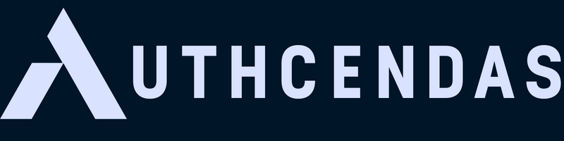
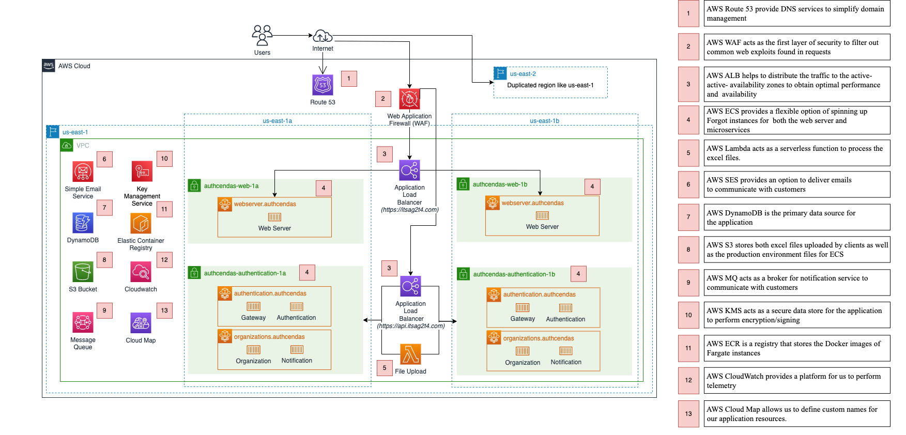

# Authcendas

View our API documentation at [https://api.itsag2t4.com/v1/docs](https://api.itsag2t4.com/v1/docs)

View our deployed production site at [https://itsag2t4.com](https://itsag2t4.com)

    
    

        
        
        
        
        
        
        
    

## Overview

**Vision**
> *Authcendas* acts as an authentication service to provide identity management for various clients such as MyBank

**Stakeholders**

- Organisational Admins
  - Manage own organisation's users, customers and staff
  - Have *READ*, *WRITE*, *DELETE* permissions
- Non-admin (Customer/User)
  - Clients of Ascenda's partners who wish to access their loyalty points
- DevOps Team
  - Builds and maintains deployed infrastructure
  - Assist in monitoring of health of services

**Features**

- File Upload
  - Organisational Admins can upload a users data file by invoking our AWS Lambda File Upload Service to be stored on AWS S3
- Seeding of User Data
  - Daily scheduled Cron job executes on Organization microservice to pull uploaded user data files from AWS S3 and seed the data into our database
- Refreshing of JWT Tokens
  - Clients can be issued with a new token without the need to relogin upon expiration of existing token
- JWKS Authentication
  - Authentication microservice provides JWT tokens signed using asymmetric keys
  - An endpoint is exposed to retrieve public key for verification by external services

**Development Workflow**

1. Development
   - Feature branches are created for new features
2. Integration
   - Performs manual local integration testing to ensure that services are working as intended prior to opening a pull request
3. Code Review
   - Upon creation of pull requests, code reviews are performed to ensure high code quality
4. Continuous Integration
   - Prior to each commit, static analyses and code formatting is performed via husky hooks
5. Continuous Delivery / Deployment
   - Upon merging of pull requests, unit tests are performed to reduce any production errors
   - Successful tests will then be built and pushed to AWS ECR
   - AWS ECS will then fetch updated Docker images from AWS ECR
6. End to End Testing
   - Manual end to end testing is performed to ensure that the services are well functional

## Architecture Diagram

## Contributors

- [Ashley Lau](https://github.com/arshhlehhhh)
- [Daryl Wong](https://github.com/wongdaryl)
- [Felice Png](https://github.com/felicepng)
- [Jerald Lim](https://github.com/jeraldlyh)
- [Jing Yuan](https://github.com/jingyuan8897)
- [Yvonne Lim](https://github.com/yvonnelhs)
